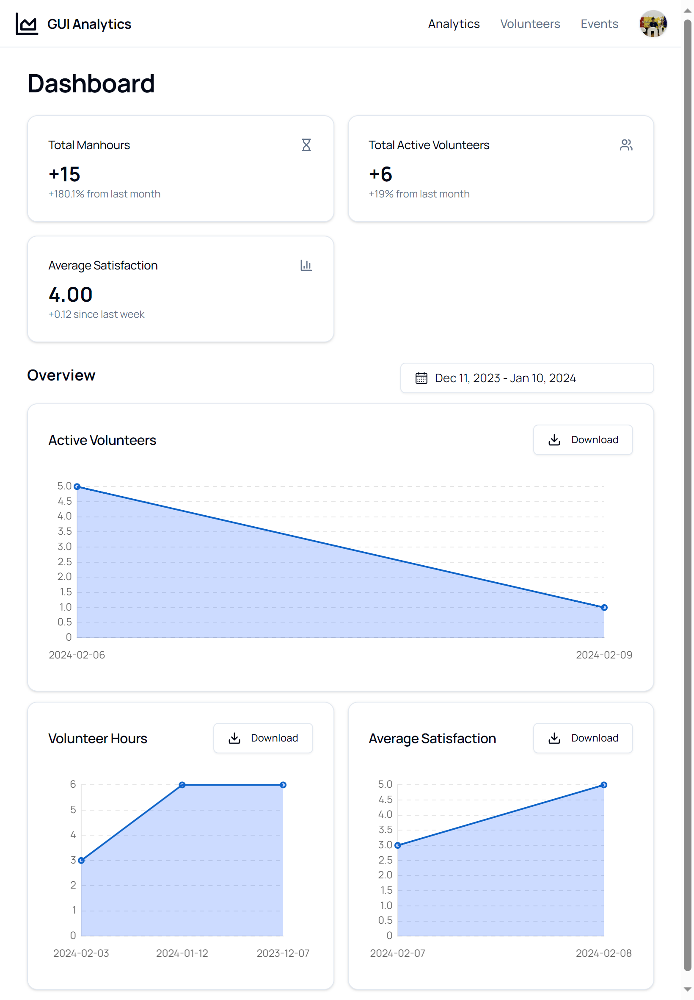

# hack4good

> **Demo**: https://hack4good-ten.vercel.app/
## About

We built an AI powered volunteer analytics platform, providing the means for NPO's to collect and store high quality feedback data.

### Use the tools you love!

This tool is integrated with **Google Forms**. We've all used it before and we know it's good, so why reinvent the wheel?

You just need to provide the permissions & link, we do all the work ingesting, storing & quantifying the responses. For this purpose, we use the
**Mixtral-8x7B-v0.1** to rate volunteer satisfaction $\in [1,5]$, along with providing a qualitative reason for this rating based on their responses.

This way, there isn't a need to enforce strict form schemas or mundane **yes/no** questions that can be easily parsed progamatically.

https://github.com/selangor-no-1/hack4good/assets/76434265/cbfbc108-b8ee-40e5-b984-b5aee79ad090

### Minimal UI & Interactive Visualisations

Distraction free, user friendly & fully mobile responsive.

## Developing

Please refer to the individual `README.md`'s within `ui/` and `server/`

## Tech Stack

### Backend

**Python** with Django, SQLite, Pydantic, OpenAI, Instructor, Google Forms API managed with **Poetry**

Deployed on [fly.io](fly.io)

### Frontend

**Svelte/Typescript** with SvelteKit, TailwindCSS, shadcn/ui, Marked, Chart.JS, Zod

Deployed on [Vercel](vercel.com)

### System Diagram

